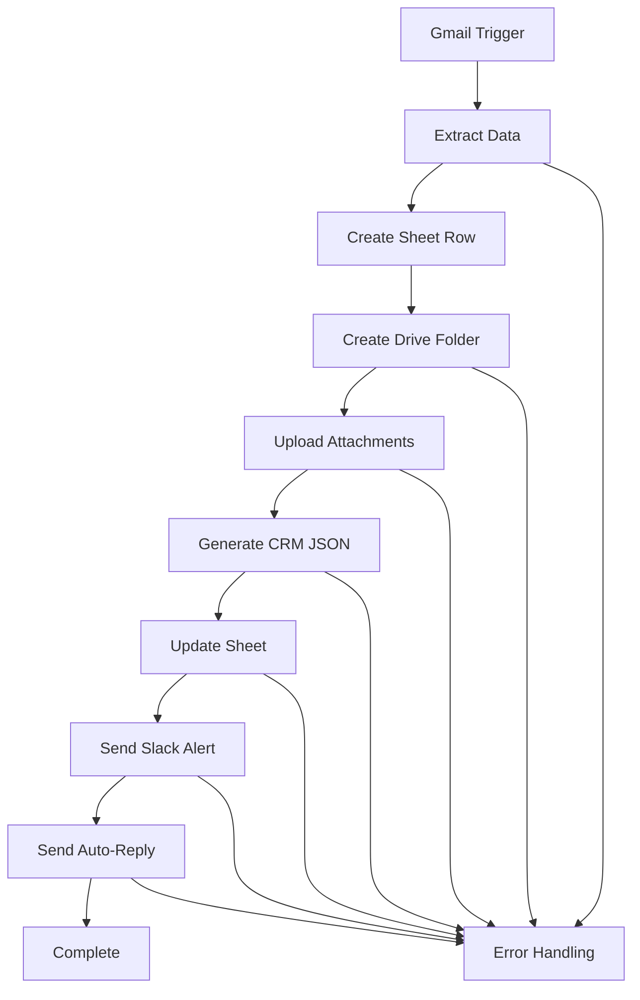
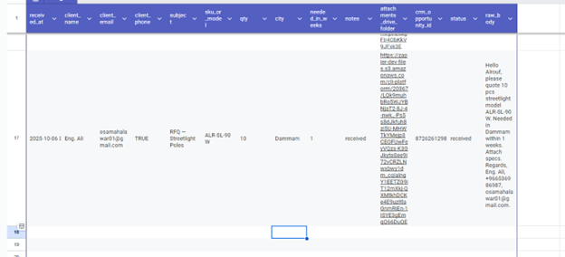
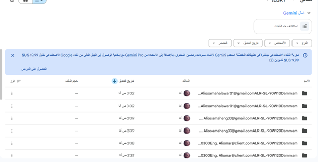
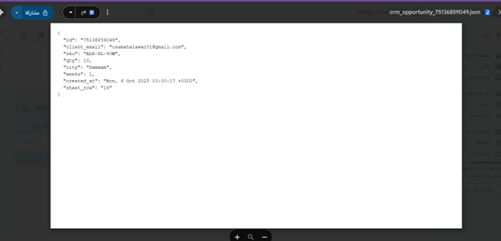
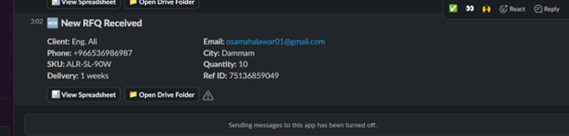
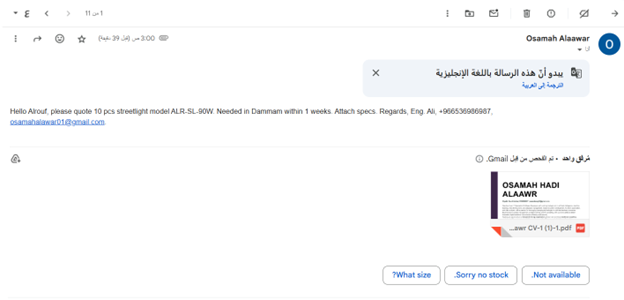

# RFQ Automation System | نظام أتمتة RFQ

<div align="center">


</div>

## Overview | نظرة عامة

**English:**
An intelligent automation system that ingests RFQ (Request for Quotation) emails, extracts key fields using advanced regex patterns, stores data in Google Sheets, archives attachments in Google Drive, generates CRM-ready JSON files, sends internal Slack alerts, and provides bilingual auto-replies to customers.

**العربية:**
نظام أتمتة ذكي لاستقبال رسائل RFQ (طلب عرض أسعار)، استخراج الحقول الرئيسية باستخدام أنماط regex متقدمة، حفظ البيانات في Google Sheets، أرشفة المرفقات في Google Drive، إنشاء ملفات JSON مخصصة للـCRM، إرسال تنبيهات داخلية في Slack، والرد التلقائي للعملاء باللغتين.

---

## System Components | مكونات النظام

| Component | English Description | Arabic Description |
|-----------|-------------------|-------------------|
| **Gmail** | RFQ email reception with Label/Filter | استقبال رسائل RFQ مع Label/Filter |
| **Formatter by Zapier** | Extract Email/Phone/Qty/SKU/City/Weeks using Regex | استخراج البريد/الهاتف/الكمية/رقم القطعة/المدينة/الأسابيع بـRegex |
| **Google Sheets** | RFQ record storage and folder link updates | حفظ سجل RFQ وتحديث رابط مجلد المرفقات |
| **Google Drive** | Create folders per RFQ and upload attachments + CRM JSON | إنشاء مجلد لكل RFQ ورفع المرفقات + ملف CRM JSON |
| **Code by Zapier** | Build clean JSON for CRM integration | بناء JSON نظيف للـCRM |
| **Webhooks by Zapier** | Send Slack messages via Incoming Webhook | إرسال رسائل Slack عبر Incoming Webhook |
| **Gmail Reply** | Bilingual auto-reply to customers | رد تلقائي عربي/إنجليزي للعملاء |
| **Looping by Zapier** | Process multiple attachments when needed | معالجة مرفقات متعددة عند الحاجة |
| **Filters/Paths** | Error paths and logical branching | مسارات أخطاء وتفرعات منطقية |

---

## Google Sheets Structure | بنية Google Sheets

### Main Sheet: `RFQ_Inbox` | الورقة الرئيسية

| Column | Name | English Description | Arabic Description |
|--------|------|-------------------|-------------------|
| A | `received_at` | Timestamp of receipt | طابع زمني للاستلام |
| B | `client_name` | Client name (optional) | اسم العميل (اختياري) |
| C | `client_email` | Client email address | بريد العميل |
| D | `client_phone` | Phone number | رقم الهاتف |
| E | `subject` | Email subject | موضوع الرسالة |
| F | `sku_or_model` | Product SKU/Model | رقم/موديل القطعة |
| G | `qty` | Quantity requested | الكمية |
| H | `city` | Delivery city | المدينة |
| I | `needed_in_weeks` | Delivery timeframe in weeks | مدة التسليم بالأسابيع |
| J | `status` | Processing status | حالة المعالجة |
| K | `attachments_drive_folder` | Drive folder link | رابط مجلد المرفقات |
| L | `crm_opportunity_id` | CRM opportunity ID | معرّف الفرصة |
| M | `notes` | Additional notes | ملاحظات |
| N | `raw_body` | Original email body | نص الرسالة الأصلي |

### Error Sheet: `rfq_errors` | ورقة الأخطاء

| Column | Name | Description |
|--------|------|-------------|
| A | `timestamp` | Error occurrence time |
| B | `step` | Failed step name |
| C | `error_message` | Error details |
| D | `payload` | Data payload at failure |

---

## Google Drive Organization | تنظيم Google Drive

**Structure | البنية:**
```
RFQ_Archive/
├── {received_at} - {client_email} - {sku_or_model}/
│   ├── attachment_1.pdf
│   ├── attachment_2.xlsx
│   └── crm_opportunity_{ID}.json
└── ...
```

**English:** Each RFQ gets its own folder with uploaded attachments and a CRM-ready JSON file.

**العربية:** كل RFQ يحصل على مجلد منفصل يحتوي على المرفقات المرفوعة وملف JSON جاهز للـCRM.

---

## Data Extraction Patterns | أنماط استخراج البيانات

### Regex Patterns | أنماط Regex

| Field | Pattern | Description |
|-------|---------|-------------|
| **Email** | `[a-zA-Z0-9._%+-]+@[a-zA-Z0-9.-]+\.[a-zA-Z]{2,}` | Standard email pattern |
| **Phone (SA)** | `(?i)(\+?966[-\s]?5[\dX-]{7,8}\|0[-\s]?5[\dX-]{7,8})` | Saudi mobile numbers |
| **Quantity** | `\b(\d+)\b` | Extract numbers, pick largest |
| **SKU (ALR)** | `(?i)\b(ALR-[A-Z0-9-]+)\b` | ALR prefix pattern |
| **City** | `(?i)\b(?:in\|في)\s+([A-Za-z\u0600-\u06FF]+)` | City after "in/في" |
| **Weeks** | `(?i)\b(\d+)\s*weeks?\b` | Weeks pattern |

---

## Workflow | مسار العمل



### Step-by-Step Process | العملية خطوة بخطوة

1. **Gmail Trigger** | مشغل Gmail
   - New Email with RFQ label
   - رسالة جديدة مع تسمية RFQ

2. **Data Extraction** | استخراج البيانات
   - Extract email, phone, SKU, quantity, city, weeks
   - استخراج البريد، الهاتف، رقم القطعة، الكمية، المدينة، الأسابيع

3. **Google Sheets** | Google Sheets
   - Create new row with status='received'
   - إنشاء صف جديد مع الحالة='received'

4. **Google Drive** | Google Drive
   - Create dedicated folder for RFQ
   - إنشاء مجلد مخصص للـRFQ

5. **File Processing** | معالجة الملفات
   - Upload all attachments to folder
   - رفع جميع المرفقات للمجلد

6. **CRM Integration** | تكامل CRM
   - Generate JSON file with clean data
   - إنشاء ملف JSON بالبيانات النظيفة

7. **Notifications** | الإشعارات
   - Send Slack alert to team
   - إرسال تنبيه Slack للفريق

8. **Customer Response** | رد العميل
   - Send bilingual auto-reply
   - إرسال رد تلقائي ثنائي اللغة

---

## CRM JSON Template | قالب JSON للـCRM

```javascript
const toInt = v => {
  const n = parseInt(String(v).replace(/[^0-9.-]/g,''), 10);
  return Number.isFinite(n) ? n : 0;
};

const payload = {
  id: inputData.id || "UNKNOWN_ID",
  client_email: inputData.client_email || "unknown@client.com",
  sku: inputData.sku_or_model || "UNKNOWN_SKU",
  qty: toInt(inputData.qty),
  city: inputData.city || "UNKNOWN_CITY",
  weeks: toInt(inputData.needed_in_weeks),
  created_at: inputData.received_at || inputData.zap_meta_timestamp || new Date().toISOString(),
  sheet_row: inputData.row || -1
};

return { json_text: JSON.stringify(payload, null, 2) };
```

---

## Slack Webhook Payload | حمولة Slack Webhook

```json
{
  "text": "New RFQ received",
  "blocks": [
    {
      "type": "header",
      "text": {
        "type": "plain_text",
        "text": "🔔 New RFQ Received"
      }
    },
    {
      "type": "section",
      "fields": [
        {
          "type": "mrkdwn",
          "text": "*Client:*\n{{client_email}}"
        },
        {
          "type": "mrkdwn",
          "text": "*SKU:*\n{{sku_or_model}}"
        },
        {
          "type": "mrkdwn",
          "text": "*Qty:*\n{{qty}}"
        },
        {
          "type": "mrkdwn",
          "text": "*City:*\n{{city}}"
        },
        {
          "type": "mrkdwn",
          "text": "*Needed (weeks):*\n{{needed_in_weeks}}"
        }
      ]
    },
    {
      "type": "section",
      "text": {
        "type": "mrkdwn",
        "text": "*📊 Sheet:* <{{sheet_row_url}}|Open row>  •  *📁 Drive:* <{{drive_folder_link}}|Open folder>"
      }
    }
  ]
}
```

---

## Auto-Reply Templates | قوالب الرد التلقائي

### Arabic Version | النسخة العربية

```html
<div dir="rtl" style="font-family: Arial, sans-serif;">
<h3>مرحباً {{client_name}},</h3>

<p>استلمنا طلب عرض السعر الخاص بك للمنتج <strong>{{sku_or_model}}</strong> 
بكمية <strong>{{qty}}</strong> قطعة لمدينة <strong>{{city}}</strong>.</p>

<p><strong>رقم المرجع لدينا:</strong> {{crm_opportunity_id}}</p>

<p>سنعود إليك بعرض السعر التفصيلي خلال 1–2 يوم عمل.</p>

<p>تحياتنا،<br>
فريق مبيعات الروف</p>
</div>
```

### English Version | النسخة الإنجليزية

```html
<div style="font-family: Arial, sans-serif;">
<h3>Hello {{client_name}},</h3>

<p>We have received your RFQ for <strong>{{sku_or_model}}</strong> 
with quantity <strong>{{qty}}</strong> pieces for <strong>{{city}}</strong>.</p>

<p><strong>Our reference number:</strong> {{crm_opportunity_id}}</p>

<p>We will get back to you with a detailed quotation within 1–2 business days.</p>

<p>Best regards,<br>
Alrouf Sales Team</p>
</div>
```

---

## Error Handling | التعامل مع الأخطاء

### Error Scenarios | سيناريوهات الأخطاء

| Scenario | English Action | Arabic Action |
|----------|---------------|---------------|
| **No Attachments** | Write error row, stop workflow | كتابة صف خطأ، إيقاف المسار |
| **Upload Failure** | Log error, continue with notification | تسجيل الخطأ، متابعة الإشعار |
| **Slack Failure** | Log error, continue with auto-reply | تسجيل الخطأ، متابعة الرد التلقائي |
| **Gmail Reply Failure** | Log error, mark as partially complete | تسجيل الخطأ، وضع علامة مكتمل جزئياً |

### Default Values | القيم الافتراضية

```javascript
const defaults = {
  client_email: "unknown@client.com",
  sku_or_model: "UNKNOWN_SKU",
  qty: 0,
  city: "UNKNOWN_CITY",
  weeks: 0,
  status: "error"
};
```

---

## Testing & Deployment | الاختبار والنشر

### Testing Checklist | قائمة الاختبار

- [ ] **Gmail Integration** | تكامل Gmail
  - [ ] Email reception with RFQ label
  - [ ] Attachment handling
  
- [ ] **Data Extraction** | استخراج البيانات
  - [ ] Email address extraction
  - [ ] Phone number extraction (Saudi format)
  - [ ] SKU pattern matching
  - [ ] Quantity parsing
  - [ ] City extraction
  - [ ] Weeks extraction

- [ ] **Google Services** | خدمات Google
  - [ ] Sheets row creation
  - [ ] Drive folder creation
  - [ ] File uploads
  - [ ] JSON file generation

- [ ] **Notifications** | الإشعارات
  - [ ] Slack webhook delivery
  - [ ] Auto-reply sending (both languages)

- [ ] **Error Handling** | معالجة الأخطاء
  - [ ] Error logging to rfq_errors sheet
  - [ ] Graceful failure handling

---

## Requirements | المتطلبات

### Technical Requirements | المتطلبات التقنية

- **Gmail Account** | حساب Gmail
  - Configured with RFQ label/filter
  - مهيأ مع تسمية/فلتر RFQ

- **Google Workspace** | مساحة عمل Google
  - Access to Google Sheets
  - Access to Google Drive
  - وصول إلى Google Sheets وGoogle Drive

- **Slack Integration** | تكامل Slack
  - Incoming Webhook configured
  - Webhook واردة مهيأة

- **Zapier Account** | حساب Zapier
  - Professional plan recommended for advanced features
  - خطة احترافية مُوصى بها للميزات المتقدمة

---

## Deliverables | التسليمات

### Documentation | التوثيق

- [ ] **Zapier Workflow Screenshots** | لقطات مسار Zapier
  - Screenshots of each step configuration
  - لقطات لإعداد كل خطوة

- [ ] **Sample Data** | بيانات عينة
  - Test Google Sheet with sample RFQ
  - Sample Drive folder with attachments and JSON
  - ورقة Google تجريبية مع RFQ عينة
  - مجلد Drive عينة مع المرفقات وJSON

- [ ] **Notifications** | الإشعارات
  - Sample Slack message
  - Sample auto-reply (Arabic & English)
  - رسالة Slack عينة
  - رد تلقائي عينة (عربي وإنجليزي)

- [ ] **Error Logs** | سجلات الأخطاء
  - rfq_errors sheet with at least one test error
  - ورقة rfq_errors مع خطأ تجريبي واحد على الأقل

---

## Support & Maintenance | الدعم والصيانة

### Monitoring | المراقبة

**English:** Regular monitoring of Zap History, error logs, and Google Sheets for optimal performance.

**العربية:** مراقبة منتظمة لتاريخ Zap، سجلات الأخطاء، وGoogle Sheets للأداء الأمثل.

### Updates | التحديثات

**English:** System updates may be required for regex patterns, email templates, or integration endpoints.

**العربية:** قد تتطلب التحديثات تعديل أنماط regex، قوالب البريد، أو نقاط التكامل.

---

## Screenshots & Visual Documentation | لقطات الشاشة والتوثيق المرئي

### Zapier Workflow Screenshots | لقطات مسار Zapier

**Step 1: Gmail Trigger Setup | إعداد مشغل Gmail**


**Step 2: Data Extraction & Processing | استخراج ومعالجة البيانات**


**Step 3: Google Services Integration | تكامل خدمات Google**


**Step 4: Notifications & Auto-Reply | الإشعارات والرد التلقائي**


### Google Services Integration | تكامل خدمات Google

**Google Sheets Integration | تكامل Google Sheets**


**Google Drive Folder Structure | بنية مجلد Google Drive**


**CRM JSON File in Google Drive | ملف CRM JSON في Google Drive**


**CRM JSON File Content | محتوى ملف CRM JSON**


### Email Processing | معالجة البريد الإلكتروني

**Received RFQ Email Test | اختبار استقبال بريد RFQ**


**Auto-Reply Email from System | الرد التلقائي من النظام**


### Slack Integration | تكامل Slack

**Slack Notification | إشعار Slack**


**Email From Cutomer | الايميل المرسل من العميل**



### Video Demonstration | عرض فيديو

**Complete System Demo | عرض النظام الكامل**

A comprehensive video demonstration of the entire RFQ automation workflow is available: `video_for_Task1_Zapier.mp4`

عرض فيديو شامل لمسار أتمتة RFQ الكامل متاح في الملف: `video_for_Task1_Zapier.mp4`

---

## Files Structure | هيكل الملفات

```
Task1/
├── README.md                                          # هذا الملف
├── exported-zap-2025-10-06T00_35_24.690Z.json       # تصدير Zapier (للمرجع)
├── video_for_Task1_Zapier.mp4                       # فيديو توضيحي
├── Screenshot1_from Zaps.png                         # لقطة Zapier الخطوة 1
├── Screenshot2_from Zaps.png                         # لقطة Zapier الخطوة 2
├── Screenshot3_from Zaps.png                         # لقطة Zapier الخطوة 3
├── Screenshot4_from Zaps.png                         # لقطة Zapier الخطوة 4
├── Screenshot_1_from_GoogleSheets.png                # لقطة Google Sheets
├── Screeshot_1_From_GoogleDrive.png                  # لقطة Google Drive
├── Screenshot_1_from_GoogleDrive_for_CRM-JSON file.png # لقطة ملف CRM JSON
├── Content_of_CRM-JSON_File.png                      # محتوى ملف CRM JSON
├── Screenshot_1_from Email_Recived_email_inMyEmailTo_Test.png # البريد المستلم
├── Screenshot_1_from Email_ReplayEmail from system.png # الرد التلقائي
├── Screenshot_1_From_Slack.png                       # إشعار Slack
└── Picture6.png                                      # نظرة عامة النظام
```

---

## License | الترخيص

This project is proprietary and confidential.

هذا المشروع ملكية خاصة وسري.

---

<div align="center">

**Made with ❤️ for Alrouf Company**

**صُنع بـ ❤️ لشركة الروف**

</div>


